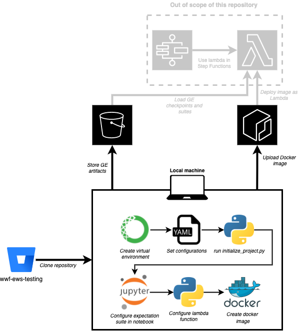
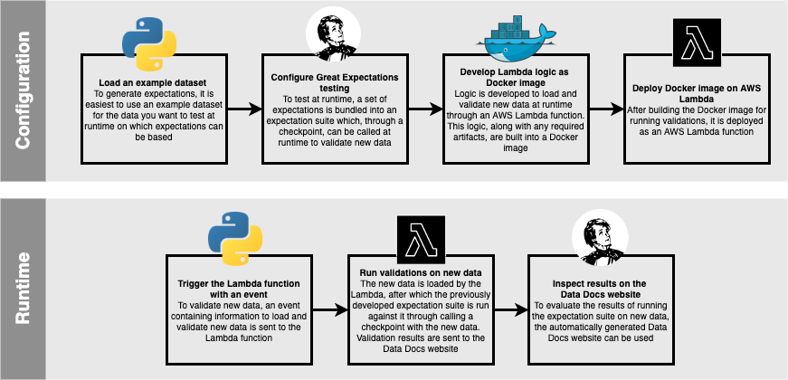
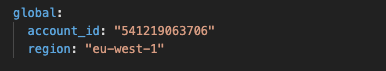
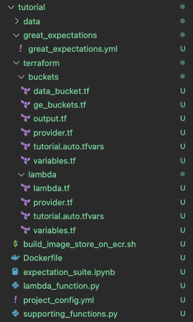
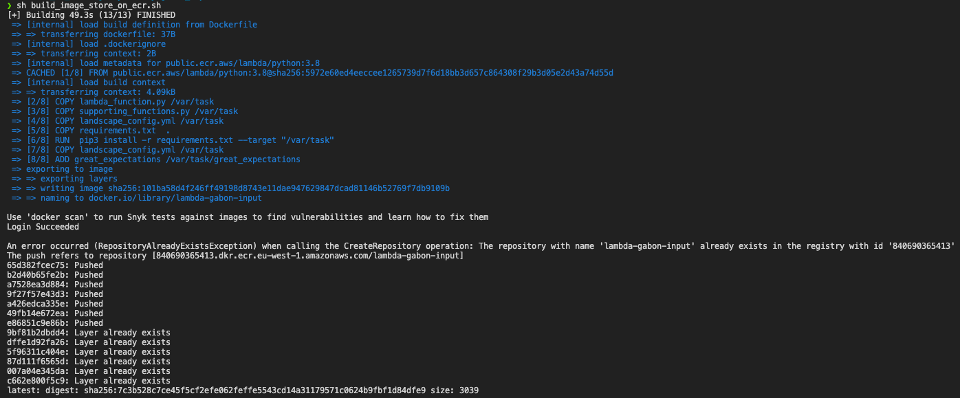
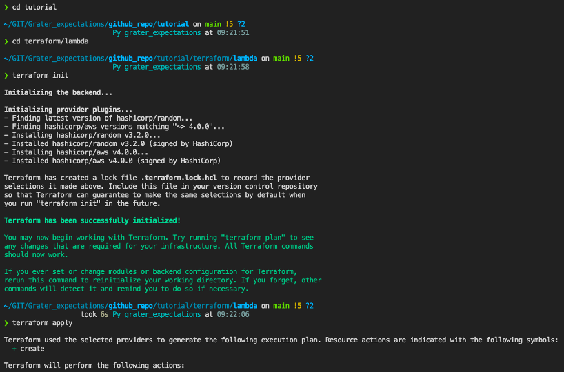
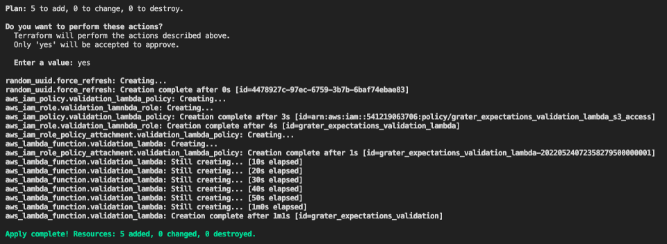

# Grater Expectations


Welcome to Grater Expectations! In this repository, you will find code, notebooks and configurations that help you implement data testing using [Great Expectations](https://greatexpectations.io/). In doing so, a subset of logic was taken from Great Expectations - or *grated* - and implemented in Python to get you up, running and testing your data fast and as such, Grater Expectations was born!

In this project a combination of Python, Docker, Terraform and AWS services are used to enable you to quickly bootstrap a new project for testing your data. This README will explain you exactly how that works and how you can get started.

A tutorial is also available to walk you through Grater Expectations. Please refer to the [Tutorial](#tutorial) section for more information.

## Table of contents
* [Project decisions](#project-decisions)
* [Project setup](#project-setup)
* [High-level workflow](#high-level-workflow)
* [Setting up your system](#setting-up-your-system)
* [Getting started](#getting-started)
* [Creating a new project](#creating-a-new-project)
* [Writing expectations](#writing-expectations)
* [Configuring the validation Lambda](#configuring-the-validation-lambda)
* [Deploying the Lambda as Docker image on ECR](#deploying-the-lambda-as-docker-image-on-ecr)
* [Deploying the Lambda on AWS](#deploying-the-lambda-on-aws)
* [Tutorial](#tutorial)
<br>
<hr>

## Project decisions
In order to quickly get you up-and-running with data testing, a couple of decisions were made for the implementation of Grater Expectations. These are:

* Great Expectations is the package used for running tests (expectations in GE jargon)
* Any files and artifacts generated by Great Expectations will be stored on S3
* Batches of data will always be loaded at runtime, using loading logic defined by the developer
* Sets of tests (*expectation suites*) are developed using an iPython notebook available 
in this repository
* The logic to validate data at runtime is deployed as a Lambda function using a Docker
container image (to circumvent package layer size constraints of Lambdas)
* Terraform code is available to spin up the required S3 objects and Lambda function, but this can also be done manually
* The code and logic contained within this repository should be able to run on both
Windows and Mac OS

<br>
<hr>

## Project setup

The general setup of all components of this repository is as follows:



<br>
<hr>

## High-level workflow

The (simplified) workflow of using Grater Expectations to develop and implement data testing logic is as follows:



<br>

The overall idea is to **configure** data testing by using Great Expectations, so that a preset selection of tests can be run over new data at **runtime**.

In order to **configure** Great Expectations, an example dataset representative of future data to be tested is loaded. Using this dataset, multiple tests (*expectations*) are defined and bundled into a set of tests (*expectation suite*). In order to call this expectation suite at runtime, it is connected to a checkpoint. This checkpoint can then be called at runtime to test new data against, the logic of which is developed in a Python script and built into a Docker image. This image is deployed as an AWS Lambda.

At **runtime**, an event containing information on which new data to load and test can then be sent to the deployed Lambda to invoke it. The Lambda will then load and validate the new data, using the checkpoint and expectation suite previously developed. The results will then be published on a so-called Data Docs website, which end users can then inspect.

<br>
<hr>

## Setting up your system
To run all components of this repository, you will need the following:

-  **AWS account**: to deploy services through using [programmatic access keys](https://docs.aws.amazon.com/general/latest/gr/aws-sec-cred-types.html). You can generate access keys by logging into the console, browsing to *Security Credentials* under your account (upper right corner in console) and then creating new access keys under the *Access keys section*
- [**Docker Engine**](https://docs.docker.com/engine/): to create new images to run on AWS Lambda and push them to ECR
- [**AWS CLI**](https://aws.amazon.com/cli/): to login to AWS, create an ECR repository and push docker images to ECR. You can also install the AWS CLI easily using a package manager such as [brew](https://formulae.brew.sh/formula/awscli) or [chocolatey](https://community.chocolatey.org/packages/awscli)
- **Python 3.8**: It is recommended to use conda ([Miniconda](https://docs.conda.io/en/latest/miniconda.html)) for easy environment creation and management
- **IDE** (e.g. VS Code, optional): for easier development (not necessarily for notebooks, but definitely for Python files)
- [**Terraform**](https://www.terraform.io/) (optional): to spin up S3 buckets for GE artifacts and the Data Docs website and a Lambda function for testing

Throughout the rest of the documentation, it is assumed you have these tools and services installed on your local machine

<br>
<hr>

## Getting started

### Option 1 - Pip (Recommended)
Install Grater Expectations via [pip](https://pip.pypa.io/en/stable/getting-started/). It is recommended to create a virtual environment using Python 3.8.

```bash
# Create a virtual environment
python -m venv env

# Activate the virtual environment
env/Scripts/Activate # Windows
source env/bin/activate # MacOS

# Install into the virtual envirpnment
pip install grater_expectations
```

### Option 2 - Anaconda
Install Grater Expectations via [Anaconda](https://www.anaconda.com/products/distribution)

```bash
# Create a conda environment
conda create --name grater_expectations python=3.8

# Activate the conda environment
conda activate grater_expectations

# Install into the virtual environment
conda install grater_expectations
```
<br>
<hr>

## Creating a new project
When you want to develop a new set of tests for a specific dataset, you first need to create new configuration for your project. This can be done by running the following command:

```bash
grater create config
```

It will create a `testing_config.yml` file at the root of your current directory. Within this file, you need to change the config parameters before you can generate project files.

Nested under the project name (e.g. tutorial), the configuration file is expected to contain the following keys:

**Global parameters**
- **account_id**: id of the AWS account that can be used to provision services
- **region**: the region wherein the services should be deployed (if applicable)

Below you can find an example of a filled in global configuration.

<br>



<br>

**Project parameters**:

- **store_bucket**: the name of the S3 bucket that can be used to store Great Expectations outputs
- **store_bucket_prefix**: the prefix (or 'folder') in which the outputs should be stored
- **site_bucket**: the name of the S3 bucket that can be used for rendering Data Docs (static GE website)
- **site_bucket_prefix**: the prefix (or 'folder') in which the files for the site should be stored
- **site_name**: the name that should be given to the rendered website
- **docker_image_name**: the name that will be used for the docker image and ECR repository
  to store the image
- **expectations_suite_name**: the name for the expectation suite you will generate (
  an expectations suite is GE jargon for a bundle of expectations you will use to validate
  a dataset)
- **checkpoint_name**: name for the checkpoint that will be used to validate your dataset
  at runtime. Checkpoints are used to bundle expectation suites with data to
  validate at runtime
- **run_name_template**: the template to be used to tag validation runs with. If given
  date string formats, these will be rendered at runtime using the date at runtime
- **data_bucket**: the name of the S3 bucket in which the data resides (optional, data loading logic is developed per project and does not necessarily have to use this data_bucket)
- **prefix_data**: the prefix (or 'folder') in which the data can be found (optional, data loading logic is developed per project and does not necessarily have to use this data_bucket)

**NOTE**: S3 bucket names must be globally unique, so make sure to not pick names that are too general

Below you can find an example of a filled in project configuration:


<br>

After adding the required configurations in `testing_config.yml`, your new project can be initialized by calling `grater create project --name project_name` from the command line and passing the name of the project (mirroring the name you put down in the config) as -n or --name argument. Note that this is best done using the previously created virtual environment. You should call this script from the root directory of the repository.

For example, assuming you created the grater_expectations virtual environment, you entered
the required configuration in `testing_config.yml` under the name tutorial and you started a terminal in the root directory of the repository, a new project can be initialized as follows:

```bash
grater create project --name tutorial
```

By default, projects are initialized with files containing a lot of documentation and comments. If you would prefer to use non verbose files, use the -nv or --nonverbose flags when initializing a project, e.g. `grater create project --name project_name --nonverbose`

When the initialization runs correctly, a new project directory with related files will be set up for you and a Python notebook will be opened to start writing your first
expectation suite. The newly created directory will look like this:



**NOTE**: *normal* project directories will not contain a data directory. This is only the case for the tutorial

<br>
<hr>

## Writing expectations

After initializing a new project, an iPython notebook called `expectation_suite.ipynb` will automatically open, containing information on how to start configuring your project and writing your expectations. If you want to (re-)open said notebook at a later stage, you can do so by calling the following command from the terminal in the project directory:

```bash
nbopen expectation_suite.ipynb
```

Apart from the guidance the notebook provides, it is **important to note** that the majority of the functions used in the notebook should be stored in `supporting_functions.py`. This is because many functions in this notebook are also used in the Lambda function and by storing these in a seperate Python file, you ensure your code is DRY. This `supporting_functions.py` script is added to the Docker container image for the Lambda function.

<br>
<hr>

## Configuring the validation Lambda

After generating a testing suite, a checkpoint to run and a Data Docs website using the expectation suite notebook, the next step is to set up a Lambda function that can be called to validate new batches of data against the generated expectation suite.

When `grater create project --name project_name` was run, an initial setup for this was created in `lambda_function.py`. To make this Lambda function work, there are a few things that need to be specified by the developer:

1. **Logic for loading data**: at runtime, the Lambda needs to be able to load a batch of data to memory (as pandas DataFrame) in order to run validations. Hence, it requires logic to do so. If you've previously created such logic for the `expectation_suite.ipynb` and stored that in `supporting_functions.py`, you should import it into the Lambda function and re-use it.
2. **Event information for loading data**: in order for the Lambda function to figure out what to load, the Lambda has been set up to expect such information in the event parameter passed at runtime. E.g. if you expect the Lambda to load and validate a specific csv dataset each month, you could trigger it by sending the prefix of the dataset on S3. If the Lambda knows which bucket the data resides in, this information alone is enough for it to load it.
3. **Logic for dynamic evaluation parameters**: if your expectation suite uses dynamic evaluation parameters, these need to be provided at runtime of the Lambda

If the Lambda is properly configured, it can now be used to run validations against new data. Depending on the checkpoint used (SimpleCheckpoint or the custom checkpoint_without_datadocs_update), the Data Docs website will automatically be updated with the results of these validations.

<br>
<hr>

## Deploying the Lambda as Docker image on ECR

Because there are size constraints when it comes to using Python packages on AWS Lambda (max 250MB of loaded packages through layers), the decision was made to use Docker images instead (for which the size constraint is 10GB).

Although this decision increases the complexity of the deployment a bit, `grater create project --name project_name` already provides you with all the boilerplate code you need to create a Docker image and load it to ECR. Said logic can be found in:
- Dockerfile: this file contains the required steps to build a new Docker image to deploy on AWS
- build_image_store_on_ecr.sh: bash script containing all steps to create a new Docker image using the Dockerfile and load it to ECR, provided you have Docker Engine and AWS CLI installed and your user credentials (AWS) can be accessed.

Before deploying, however, make sure that:
- The code in `lambda_function.py` can load and validate data, as this forms the main script of the Docker image
- All functions that the Lambda function needs are accessible either through (1) imports from `supporting_functions.py` or (2) direct function definitions in `lambda_function.py`

After doing so, `build_image_store_on_ecr.sh` can be run from the project directory. This script will build a new Docker image for Python 3.8, install all dependencies within it using `requirements.txt` and copy required code- and configuration files onto the image (`supporting_function.py`, `lambda_function.py`, `project_config.yml` and `great_expectations/great_expectations.yml`). Next, it will create a new repo on AWS ECR (if needed) and upload the Docker image to it. The output in the terminal should look as follows:



**NOTE**:
1. If a prompt appears after creating the ECR repository, you can close it by pressing q.
2. For Windows users, the `build_image_store_on_ecr.sh` will not work when called from CMD or Powershell. Instead, use Git Bash (which is automatically installed on your machine when you install Git) to call the bash script. Before doing so, make sure that you export your credentials in the terminal, so it can interact with AWS. Your commands should look as follows:

```bash
# Set credentials
export AWS_ACCESS_KEY_ID=<enter_aws_access_key_here>
export AWS_SECRET_ACCESS_KEY=<enter_aws_secret_access_key_here>

# Go to the directory of your project (e.g. tutorial)
cd tutorial

# Run script from project directory
sh build_imstage_store_on_ecr.sh
```

<br>
<hr>

## Deploying the Lambda on AWS

After deploying the Docker image on ECR, it can be used in an AWS Lambda. When `grater create project --name project_name` was run, Terraform configurations wwere generated to help you set up this lambda. The configurations can be found in the terraform/lambda subdirectory of your project.

To use these, enter your terminal, browse to this directory and call the `terraform init` and `terraform apply` commands, as shown below (with AWS credentials set in the terminal).




Terraform will then present you with a plan for deploying the Lambda, which it will deploy when you enter yes at the prompt.





**NOTE**: the standard Terraform configurations for the Lambda function only give it access to the buckets for storing Great Expectations artifacts and generating the static website. You need to adjust the configurations to also give it access (if required) to the storage where the data should be loaded from. 

<br>
<hr>

## Using the Lambda

After having deployed the Lambda function, it is now ready for use! There are many ways one can go about this, such as:
* Incorporating the Lambda in a Step Function
* Setting up a monthly trigger to send the prefix(es) of new data as an event to the Lambda
* Programmatically triggering the Lambda 

Furthermore, additional Lambda's and/or logic can be set up to alert developers when validations fail (e.g. through Slack which is a built-in function of Great Expectations, or through using AWS SES to send e-mails). If you're interested in such extensions, feel free to reach out to me!

<br>
<hr>

## Tutorial

A tutorial is available to help you get started with using Grater Expectations. To run it, make sure that your [system is set up](#setting-up-your-system) for running all components. Next, [generate a virtual environment](#getting-started) to run the project in and ensure that it is used in your current terminal (e.g. by running `<environment-name>/Scripts/Activate` or `conda activate <environment-name>`).

After activating your virtual environment, it is best to set your AWS access credentials as environment variables in your current session, so these can also be accessed by programs started up from this terminal. In (Git) bash, you can do so with the following command:

<br>

```bash
# -- Activate GE virtual environment
conda activate grater_expectations

# -- Set credentials for AWS
export AWS_ACCESS_KEY_ID=<enter_aws_access_key_here>
export AWS_SECRET_ACCESS_KEY=<enter_aws_secret_access_key_here>
```

<br>

Next, make sure that you install Grater Expectations in your (new) virtual environment if you haven't done so and call create config to generate a `testing_config.yml` file, as shown below.

<br>

```bash
# Install grater expectations
pip install grater_expectations

# Generate a new config file
grater create config
```

<br>

Next, open the `testing_config.yml` configuration file and fill in the following parameters:

**Global parameters**
1. account_id
2. region

**Project parameters under tutorial** (these need to be globally unique, so be creative!):
1. store_bucket
2. site_bucket
3. data_bucket

Example values for these can be found under the [Creating a new project](#creating-a-new-project) section. You can use the default values for the other parameters. 

After doing so, you can initialize the tutorial on your local machine by calling `grater create project --name tutorial` at the root of this repository. The files for the tutorial will then automatically be generated, after which a tutorial notebook will be opened for you.
