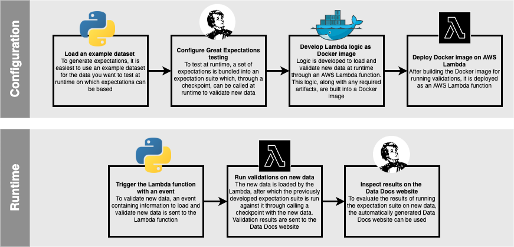

# Grater Expectations on Azure


Welcome to Grater Expectations! In this repository, you will find code, notebooks and configurations that help you implement data testing using [Great Expectations](https://greatexpectations.io/). In doing so, a subset of logic was taken from Great Expectations - or *grated* - and implemented in Python to get you up, running and testing your data fast and as such, Grater Expectations was born!

In this project a combination of Python, Docker, Terraform and AWS services are used to enable you to quickly bootstrap a new project for testing your data. This README will explain you exactly how that works and how you can get started.

A tutorial is also available to walk you through Grater Expectations. Please refer to the [Tutorial](#tutorial) section for more information.

## Table of contents
* [Project decisions](#project-decisions)
* [Project setup](#project-setup)
* [High-level workflow](#high-level-workflow)
* [Setting up your system](#setting-up-your-system)
* [Getting started](#getting-started)
* [Creating a new project](#creating-a-new-project)
* [Writing expectations](#writing-expectations)
* [Configuring the validation Lambda](#configuring-the-validation-lambda)
* [Deploying the Lambda as Docker image on ECR](#deploying-the-lambda-as-docker-image-on-ecr)
* [Deploying the Lambda on AWS](#deploying-the-lambda-on-aws)
* [Tutorial](#tutorial)
<br>
<hr>

## Project decisions
In order to quickly get you up-and-running with data testing, a couple of decisions were made for the implementation of Grater Expectations. These are:

* Great Expectations is the package used for running tests (expectations in GE jargon)
* Any files and artifacts generated by Great Expectations will be stored on Blob Storage
* Batches of data will always be loaded at runtime, using loading logic defined by the developer
* Sets of tests (*expectation suites*) are developed using an iPython notebook available 
in this repository
* The logic to validate data at runtime is deployed as a Azure Function using a Docker container image.
* Terraform code is available to spin up the required storage objects and function, but this can also be done manually
* The code and logic contained within this repository should be able to run on both
Windows and Mac OS

<br>
<hr>

## Project setup

The general setup of all components of this repository is as follows:


<br>
<hr>

## High-level workflow

The (simplified) workflow of using Grater Expectations to develop and implement data testing logic is as follows:



<br>

The overall idea is to **configure** data testing by using Great Expectations, so that a preset selection of tests can be run over new data at **runtime**.

In order to **configure** Great Expectations, an example dataset representative of future data to be tested is loaded. Using this dataset, multiple tests (*expectations*) are defined and bundled into a set of tests (*expectation suite*). In order to call this expectation suite at runtime, it is connected to a checkpoint. This checkpoint can then be called at runtime to test new data against, the logic of which is developed in a Python script and built into a Docker image. This image is deployed as an Azure Function.

At **runtime**, an event containing information on which new data to load and test can then be sent to the deployed function to invoke it. The fucntion will then load and validate the new data, using the checkpoint and expectation suite previously developed. The results will then be published on a so-called Data Docs website, which end users can then inspect.

<br>
<hr>

## Setting up your system
To run all components of this repository, you will need the following:

-  **Azure account**: to deploy services using programmatic access keys. You can generate access keys by logging into the console, browsing to *Security Credentials* under your account (upper right corner in console) and then creating new access keys under the *Access keys section*
- [**Docker Engine**](https://docs.docker.com/engine/): to create new images to run on Azure Function and push them to the container registry.
- [**Azure CLI**](https://aws.amazon.com/cli/): to login to Azure, create a container repository and push docker images to the registry. You can also install the Azure CLI easily using a package manager such as [brew](https://formulae.brew.sh/formula/awscli) or [chocolatey](https://community.chocolatey.org/packages/awscli)
- **Python 3.8**: It is recommended to use conda ([Miniconda](https://docs.conda.io/en/latest/miniconda.html)) for easy environment creation and management
- **IDE** (e.g. VS Code, optional): for easier development (not necessarily for notebooks, but definitely for Python files)
- [**Terraform**](https://www.terraform.io/) (optional): to spin up S3 buckets for GE artifacts and the Data Docs website and a Lambda function for testing

Throughout the rest of the documentation, it is assumed you have these tools and services installed on your local machine

<br>
<hr>

## Getting started

### Option 1 - Pip (Recommended)
Install Grater Expectations via [pip](https://pip.pypa.io/en/stable/getting-started/). It is recommended to create a virtual environment using Python 3.8.

```bash
# Create a virtual environment
python -m venv env

# Activate the virtual environment
env/Scripts/Activate # Windows
source env/bin/activate # MacOS

# Install into the virtual envirpnment
pip install grater_expectations
```

<br>

### Option 2 - Anaconda

```bash
# Create a conda environment
conda create --name grater_expectations python=3.8

# Activate the conda environment
conda activate grater_expectations

# Install into the virtual environment
pip install grater_expectations
```
<br>
<hr>

## Creating a new project
When you want to develop a new set of tests for a specific dataset, you first need to create new configuration for your project. This can be done by running the following command:

```bash
grater create config --provider Azure
```

It will create a `testing_config.yml` file at the root of your current directory. Within this file, you need to change the config parameters before you can generate project files.

Nested under the project name (e.g. tutorial), the configuration file is expected to contain the following keys:

**Global parameters**
- **provider**: provider for which configuration file was initialized (should say AWS)
- **account_id**: id of the AWS account that can be used to provision services
- **region**: the region wherein the services should be deployed (if applicable)

Below you can find an example of a filled in global configuration.

<br>


<br>

**Project parameters**:

- **store_bucket**: the name of the S3 bucket that can be used to store Great Expectations outputs
- **store_bucket_prefix**: the prefix (or 'folder') in which the outputs should be stored
- **site_bucket**: the name of the S3 bucket that can be used for rendering Data Docs (static GE website)
- **site_bucket_prefix**: the prefix (or 'folder') in which the files for the site should be stored
- **site_name**: the name that should be given to the rendered website
- **docker_image_name**: the name that will be used for the docker image and ECR repository
  to store the image
- **expectations_suite_name**: the name for the expectation suite you will generate (
  an expectations suite is GE jargon for a bundle of expectations you will use to validate
  a dataset)
- **checkpoint_name**: name for the checkpoint that will be used to validate your dataset
  at runtime. Checkpoints are used to bundle expectation suites with data to
  validate at runtime
- **run_name_template**: the template to be used to tag validation runs with. If given
  date string formats, these will be rendered at runtime using the date at runtime
- **data_bucket**: the name of the S3 bucket in which the data resides (optional, data loading logic is developed per project and does not necessarily have to use this data_bucket)
- **prefix_data**: the prefix (or 'folder') in which the data can be found (optional, data loading logic is developed per project and does not necessarily have to use this data_bucket)

**NOTE**: S3 bucket names must be globally unique, so make sure to not pick names that are too general

Below you can find an example of a filled in project configuration:


<br>

After adding the required configurations in `testing_config.yml`, your new project can be initialized by calling `grater create project --name project_name` from the command line and passing the name of the project (mirroring the name you put down in the config) as -n or --name argument. Note that this is best done using the previously created virtual environment. You should call this script from the root directory of the repository.

For example, assuming you created the grater_expectations virtual environment, you entered
the required configuration in `testing_config.yml` under the name tutorial and you started a terminal in the root directory of the repository, a new project can be initialized as follows:

```bash
grater create project --name tutorial
```

By default, projects are initialized with files containing a lot of documentation and comments. If you would prefer to use non verbose files, use the -nv or --nonverbose flags when initializing a project, e.g. `grater create project --name project_name --nonverbose`

When the initialization runs correctly, a new project directory with related files will be set up for you and a Python notebook will be opened to start writing your first
expectation suite. The newly created directory will look like this:


**NOTE**: *normal* project directories will not contain a data directory. This is only the case for the tutorial

<br>
<hr>

## Writing expectations

After initializing a new project, an iPython notebook called `expectation_suite.ipynb` will automatically open, containing information on how to start configuring your project and writing your expectations. If you want to (re-)open said notebook at a later stage, you can do so by calling the following command from the terminal in the project directory:

```bash
nbopen expectation_suite.ipynb
```

Apart from the guidance the notebook provides, it is **important to note** that the majority of the functions used in the notebook should be stored in `supporting_functions.py`. This is because many functions in this notebook are also used in the Lambda function and by storing these in a seperate Python file, you ensure your code is DRY. This `supporting_functions.py` script is added to the Docker container image for the Lambda function.

<br>
<hr>